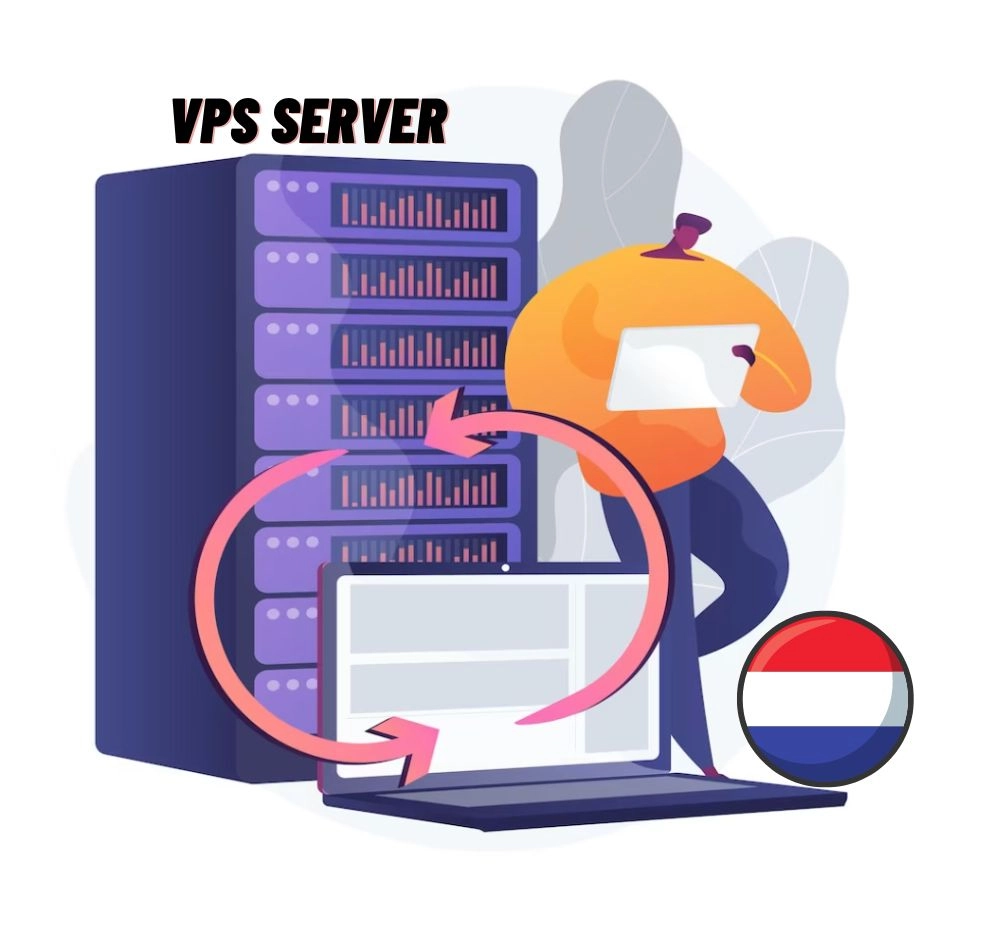

# Top VPS Hosting in the Netherlands: The 2025 Guide

Privacy matters. Your data, your business, your rules. But here's the thing—dedicated servers cost a fortune. So what's the middle ground? VPS hosting. Specifically, VPS hosting in the Netherlands, where privacy laws actually mean something and DMCA complaints don't automatically shut you down.

If you're looking at Dutch hosting, you're probably already thinking about data sovereignty, European regulations, or maybe just want your site hosted somewhere that respects digital freedom. Smart move. The Netherlands sits right between Asia and the Americas, has rock-solid infrastructure, and doesn't mess around when it comes to privacy.

Let's cut through the noise and look at what actually works.

---

## What Makes Netherlands VPS Hosting Different?

VPS hosting gives you a virtual private server—your own slice of a physical machine, isolated from everyone else. You get dedicated resources, root access, and the freedom to configure things your way. Think of it as the sweet spot between shared hosting (where you're crammed in with hundreds of other sites) and dedicated servers (where you pay premium prices for hardware you might not fully utilize).

But hosting in the Netherlands specifically? That's where things get interesting. The country has a mature digital infrastructure, excellent connectivity to both European and international networks, and—here's the kicker—DMCA takedown notices don't carry the same weight they do in the US. Your content stays online unless it actually violates Dutch law, not just because someone filed a complaint.

The performance is solid too. Amsterdam's data centers are interconnected hubs with low latency to most of Europe, decent routes to Asia, and reliable transatlantic links. For global reach without the hassle of managing multiple server locations, it's hard to beat.

👉 **Looking for hosting that prioritizes both performance and privacy?** [Discover how Vultr's Netherlands data centers deliver enterprise-grade infrastructure with straightforward pricing](https://www.vultr.com/?ref=9738262-9J), making it easier to scale your applications without worrying about sudden takedowns or restricted content policies.

## 9 VPS Hosting Providers Worth Your Attention

Here's what we found after digging through specs, testing performance, and comparing actual user experiences:

### 1. QloudHost - When Privacy Isn't Negotiable

Some hosting companies talk about privacy. QloudHost actually delivers it. They specialize in offshore hosting with DMCA-ignored policies, meaning your site won't vanish because someone filed a complaint. The servers sit in the Netherlands, where content regulations are more reasonable.

What makes them stand out:
- **No locked-in contracts**: Cancel whenever you want, no questions asked
- **Free migration**: They'll move your site over without charging you
- **Offshore protection**: Your content is hosted under Dutch jurisdiction

Their VPS plans start around €15/month and scale up based on resources. Not the cheapest option, but if content freedom matters to your business, the premium makes sense.

### 2. YouStable - Managed Hosting That Actually Manages

YouStable takes the technical headache out of hosting. They're an Indian company that's expanded globally, and their managed VPS service means you don't need to be a Linux expert to run a solid server.

Key features:
- **Free site migration**: Switch without downtime
- **Proactive monitoring**: They watch your server and alert you before problems escalate  
- **Let's Encrypt SSL**: Automatic HTTPS setup included

Plans start at around $10/month with their "VPS50" discount code for annual billing. They offer 100% DDoS protection and 24/7 support, which is useful when something breaks at 3 AM.

### 3. Kamatera - Pay for What You Use

Kamatera's approach is simple: build your own server configuration and pay only for the resources you select. No bundled features you'll never use, no paying for capacity you don't need.

The flexibility is real:
- **Custom builds**: Choose your CPU, RAM, storage, and bandwidth independently
- **Hourly or monthly billing**: Scale up for traffic spikes, scale down when quiet
- **30-day free trial**: Test before committing

Base plans start around $4/month, but your actual cost depends on your configuration. They offer managed hosting as an add-on if you need expert oversight. The Amsterdam location gives you solid European connectivity with routes that don't bottleneck.

### 4. TMDHosting - Fully Managed, Actually Premium

TMDHosting costs more than budget providers, but there's a reason businesses choose them. Their managed VPS service genuinely handles the technical work, letting you focus on your business instead of server administration.

What you get:
- **Complete management**: They handle updates, security, optimization
- **Free CloudFlare CDN**: Speed boost included
- **Multiple security layers**: SSL, firewalls, BitNinja protection
- **Knowledge base**: Video tutorials and documentation

Plans run from around $20-60/month depending on resources. Not cheap, but appropriate for production environments where downtime costs money. The CloudFlare integration alone can make a visible difference in page load times.

👉 If you need a hosting solution that handles the technical complexity while giving you room to grow, [Vultr's managed services combine powerful infrastructure with intuitive controls](https://www.vultr.com/?ref=9738262-9J). Their Netherlands location ensures compliance with European data regulations while maintaining the performance your applications demand.

### 5. UltaHost - Budget-Friendly Without Compromise

UltaHost proves affordable doesn't mean inadequate. They offer multiple control panel options (cPanel, CyberPanel, Plesk, Hestia) so you can work with familiar tools.

Notable features:
- **Panel flexibility**: Choose your preferred management interface
- **Unlimited bandwidth**: No surprise overage charges
- **Staging environment**: Test changes before going live

Pricing varies by control panel—starting from $5.50/month for free panels up to $24.50/month for cPanel plans. The unlimited bandwidth is genuinely useful if your traffic is unpredictable or growing.

### 6. ScalaHosting - SPanel Makes Sense

ScalaHosting built their own control panel because cPanel licensing got expensive. SPanel does what you need without the bloat or cost.

Why consider them:
- **Off-site backups**: Your data stays safe even if the server fails
- **Unmetered bandwidth**: Traffic won't inflate your bill
- **Custom panel**: SPanel is cleaner than cPanel, honestly

Plans are competitively priced and include features that other hosts charge extra for. The off-site backup system is particularly smart—it's stored separately from your main server, so hardware failure doesn't mean data loss.

### 7. LiquidWeb - Enterprise Performance

LiquidWeb targets businesses that can't afford downtime. Their infrastructure is robust, their support responds fast, and their security is tight.

Core strengths:
- **DDoS protection**: Standard, not an upsell
- **CloudFlare CDN**: Included for speed
- **Right-sized plans**: CPU/RAM ratios optimized for different workloads
- **Flexible scaling**: Upgrade without extended downtime

Premium pricing reflects premium service. Expect plans from $50-150/month depending on resources. The 100% uptime guarantee is backed by real infrastructure investment, not marketing promises.

### 8. Cloudways - Multi-Provider Platform

Cloudways doesn't own servers—they manage them for you across providers like DigitalOcean, AWS, and Google Cloud. Pick the infrastructure you trust, and they handle the administration.

Platform benefits:
- **Auto-healing**: System recovery without manual intervention
- **Free SSL setup**: One-click installation
- **Cloning tools**: Duplicate servers or applications instantly
- **Staging areas**: Test safely before pushing live

Pricing depends on your chosen provider: DigitalOcean starts around $14/month, AWS around $40/month, Google Cloud around $37/month. You're essentially getting Cloudways' management layer on top of infrastructure you select.

### 9. Vultr - Straightforward SSD Performance

Vultr keeps things simple: fast SSD storage, multiple locations, competitive pricing. They're well-established and reliable.

Basic advantages:
- **SSD storage**: Faster than traditional drives
- **One-click apps**: Deploy common software instantly
- **Global locations**: Choose from numerous data centers

Plans start around $6/month for basic configurations and scale based on your needs. The Amsterdam location provides solid European connectivity with good international routing.

---

## Why Netherlands Hosting Makes Business Sense

Let's be direct about the advantages:

**Speed**: Amsterdam is a major internet hub. Routes to Europe, Asia, and the Americas are well-optimized. Your visitors get faster load times, search engines rank you higher, and users stick around longer.

**Legal framework**: DMCA complaints don't automatically mean takedowns. Dutch law requires actual violations, not just accusations. If you're running a content platform, forum, or user-generated content site, this matters significantly.

**Privacy**: European data protection regulations are stricter than most. Your data isn't subject to casual government requests without proper legal process.

**Reliability**: Dutch infrastructure is mature and well-maintained. Power is stable, connectivity is redundant, and data centers meet international standards.

---

## The Bottom Line

VPS hosting in the Netherlands isn't just about avoiding DMCA issues—though that's a legitimate benefit. It's about choosing a location with solid infrastructure, reasonable regulations, and excellent connectivity. Whether you're running a content platform, an e-commerce site, or business applications, Dutch hosting provides a stable foundation.

Of the providers we examined, QloudHost and YouStable offer the best balance of privacy protection and performance for most users. Kamatera wins on flexibility and cost control. If your budget allows for premium service, TMDHosting and LiquidWeb deliver genuinely managed hosting. Cloudways gives you choice across multiple infrastructure providers with unified management.

Choose based on your actual needs: if content freedom matters, prioritize offshore providers. If you need predictable costs, look at unmetered bandwidth options. If your technical skills are limited, managed hosting saves you headaches. The Netherlands location gives you a solid baseline regardless of which provider you select.

Your data, your rules, hosted somewhere that respects both.
